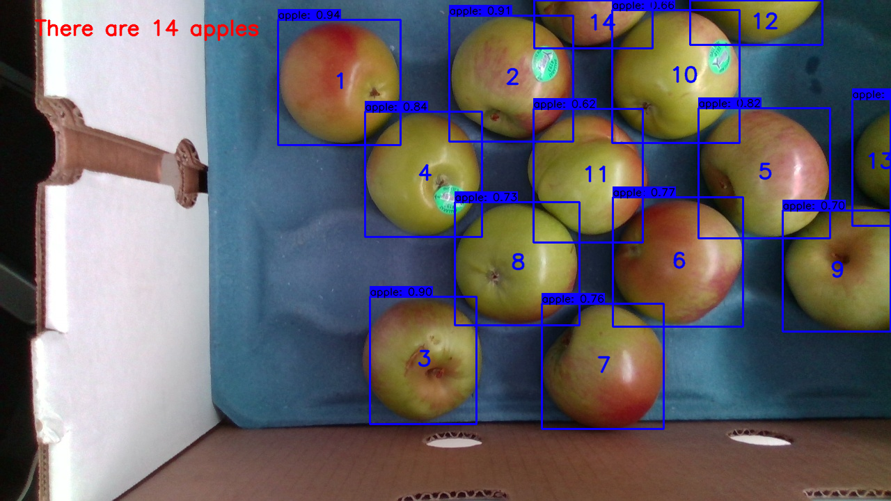

# Welcome

## Instructions

To detect the apples in the images on the data 
folder simply **clone** the repository, install the 
**requirements.txt** and download the [weights](https://drive.google.com/open?id=1cewMfusmPjYWbrnuJRuKhPMwRe_b9PaT), 
place the weights at the data folder then run the **DetectFolder.sh** file

Alternatively, you can run the script DwonloadWeights.sh

Apple Detection Results:

